+++
date = '2025-05-13T21:33:59+01:00'
draft = true
title = 'La Notifications Add Remove Users From Group'
+++

> **NOTE:** output is not perfectly refined it displays a key value pair e.g {"email":"joe.bloggs@email.com"} with a blank key, however, this met my desired outcome, when I have time I will refine and update this post.


Log in to [portal.azure.com](https://portal.azure.com), search for and click on 'Logic app'.

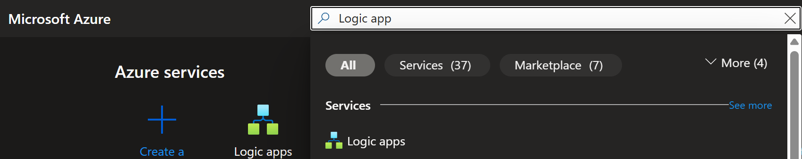

<!-- Example of how to resize an image   -->

Click Add.



Tick the Multi-tenant option within "Consumption" and click select.



Create a new resource group by clicking on the 'Create new' button under the Resource group value box and enter the name of your new resourse group.

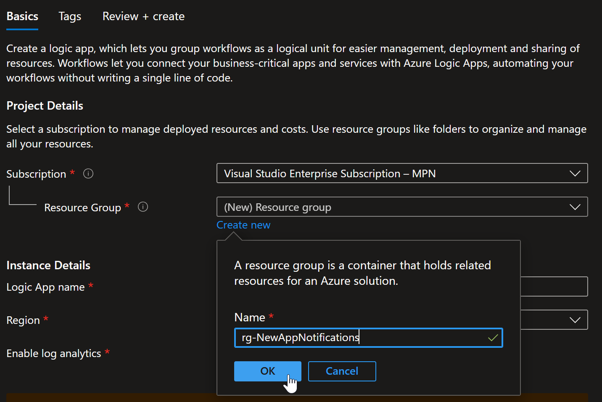

Name your logic app and select the desired region, I will be using UK South, for this demo I will not be enabling log analytics. Click 'Review + create'.

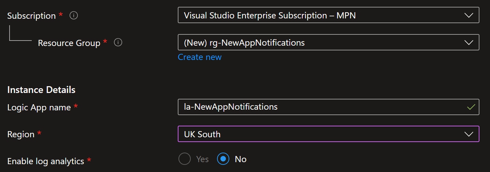

Once your config has validated click create.

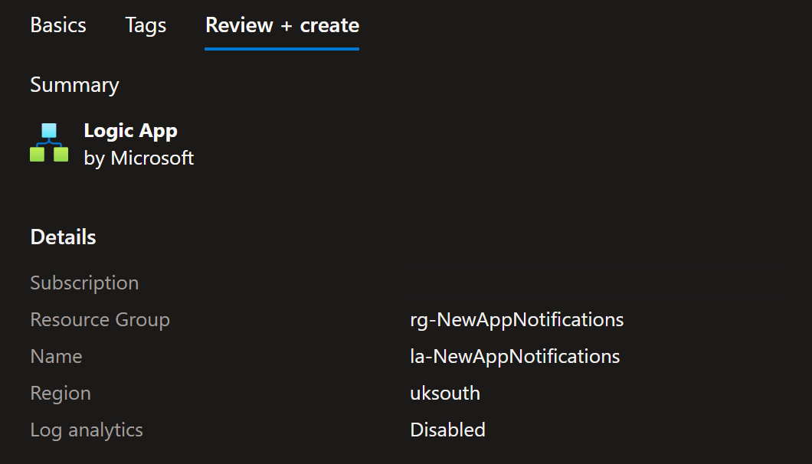

Once your logic app has been deployed click 'Go to resource'

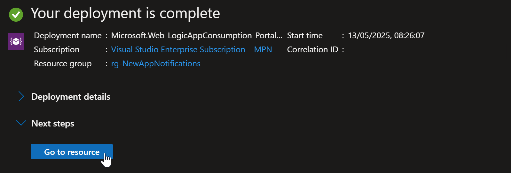


You should now see your newly created logic app, Expand 'Settings' on the left hand side menu and select 'Identity'

**INSERT SCREENSHOT**

Change the status of the 'System assigned' identity to 'On' and click 'Save'.

**INSERT SCREENSHOT**

We now need to grant the System assigned identity we just created the relevant permissions, to do this we

**FINISH THE PERMISSIONS SECTION**

from the menu on the left hand side expand 'Development Tools' and click 'Logic app designer'.

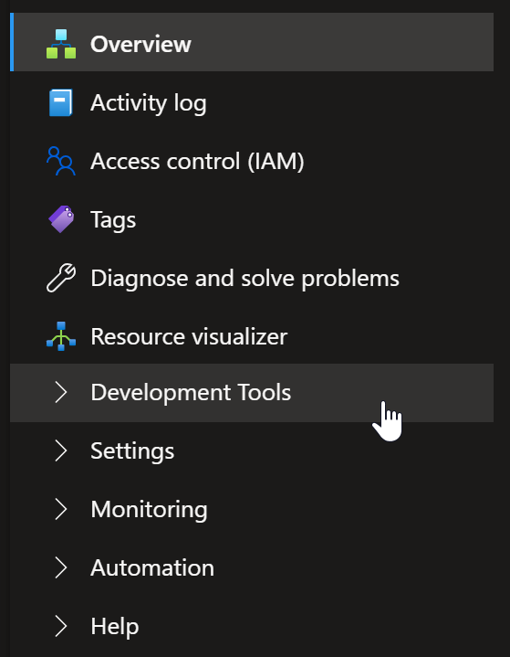

Click 'Add a trigger'.

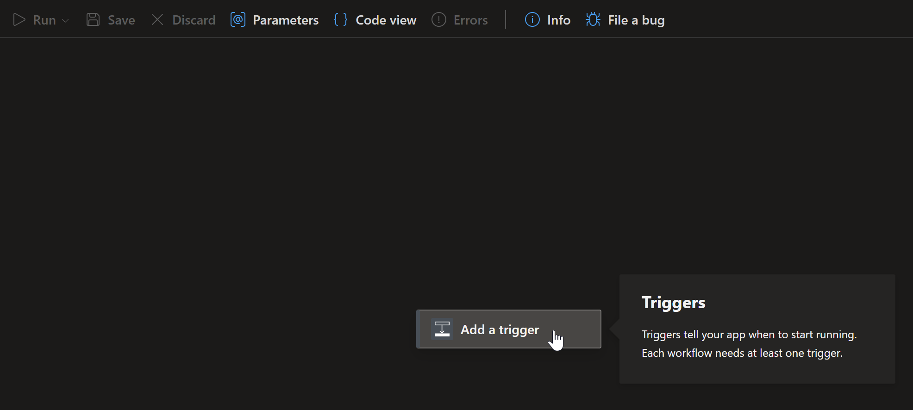

Search for and click 'Recurrence'.

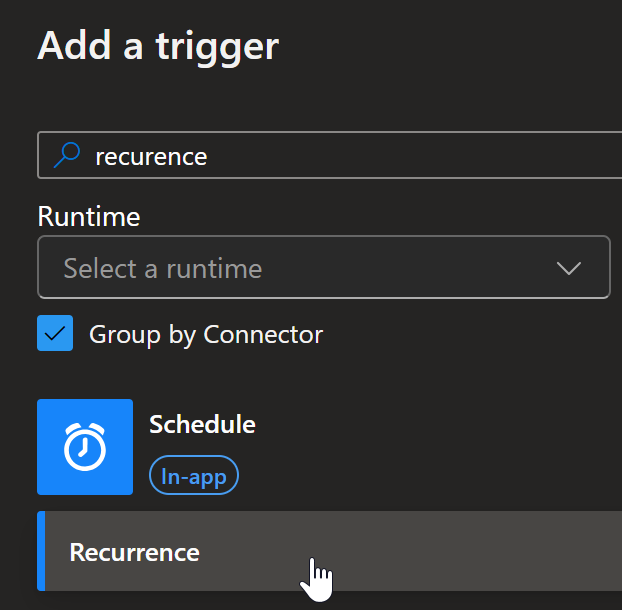

You will now have a recurrence trigger within your designer window and its settings on the right hand side. Here we configure the recurrence, I am setting the recurrence to run every 1 day at 21:00 (UTC+00:00) Dublin, Edinburgh, Lisbon, London and to start on 13/05/2025 at 21:00 and then run at 21:00 each day.

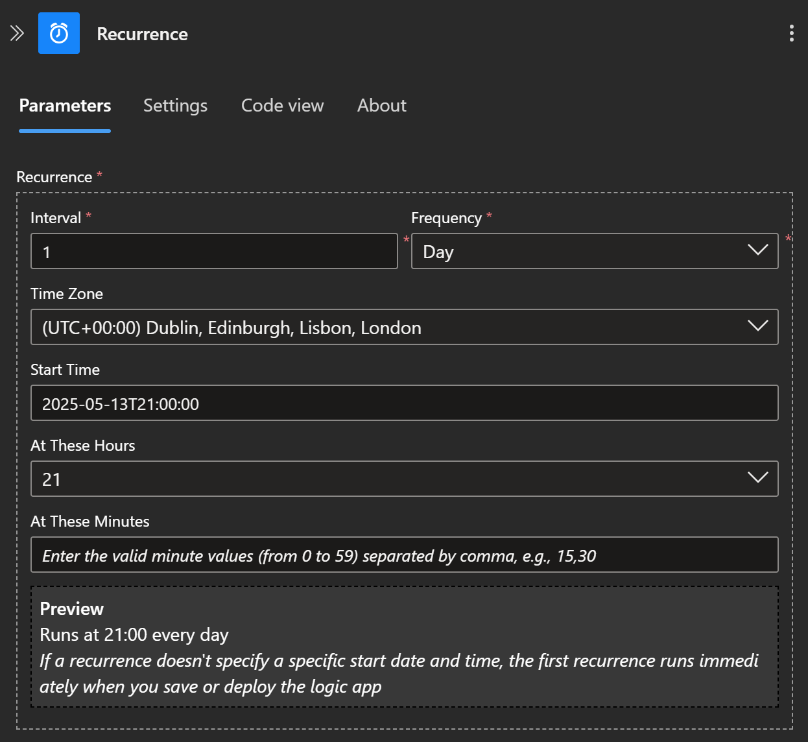

Click the + button under the recurrence trigger then click 'Add an action'.

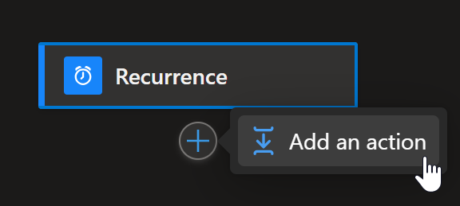

Search and click on 'HTTP'

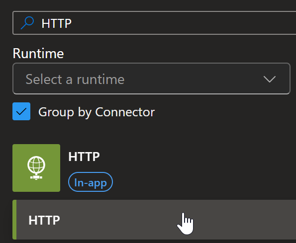

Now enter the below options, make sure to substitue *YOURGROUPSOBJECTID* with the object id of the group you'd like to monitor:

You can also rename each of your actions by clicking on the title of the action erasing and typing in your desired name, In this example I have change the name 'HTTP' to 'get-group-members'. Be as descriptive as you can to make life for your future self easier.

|                    |                    |
|--------------------|--------------------|
|**URI:**            | https://graph.microsoft.com/v1.0/groups/YOURGROUPSOBJECTID/members?$top=999&select=id,displayName,userPrincipalName|
|**Method:**         | GET                |
|**Authentication:** | System-managed identity|
|**Audience:**       | https://graph.microsoft.com/|


**INSERT SCREENSHOT**

Now add a Parse JSON action, we'll use this action to parse the output of our previous graph query to make it easier to work with.

|                    |                    |
|--------------------|--------------------|
|**Content:**        | body('get-group-members')?['value'] |

```{

  "type": "array",

  "items": {

    "type": "object",

    "properties": {

      "@@odata.type": {

        "type": "string"

      },

      "id": {

        "type": "string"

      },

      "displayName": {

        "type": "string"

      },

      "userPrincipalName": {

        "type": "string"

      }

    },

    "required": [

      "@@odata.type",

      "id",

      "displayName",

      "userPrincipalName"

    ]

  }

}```